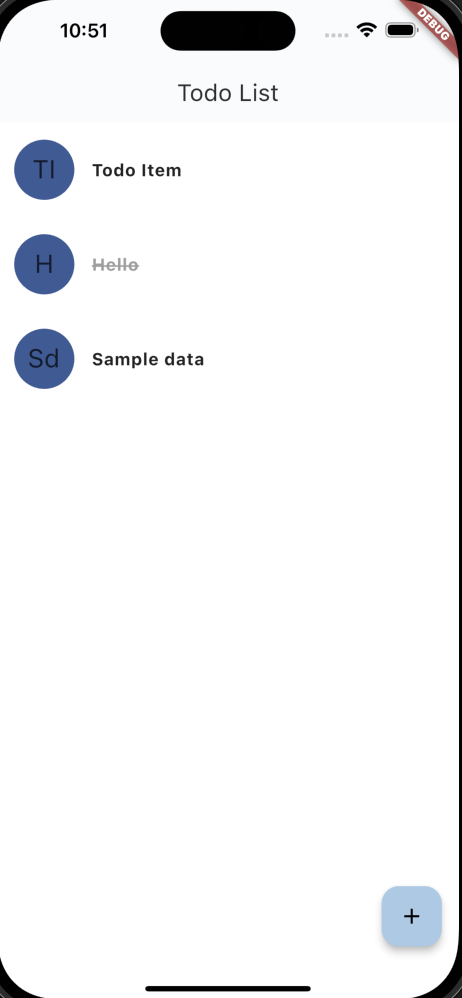

# Simple Todo List

## Requirement

Flutter 3.7.7

## Supported Platform

- iOS
- Android

## Architecture

We use Bloc as an state management pattern. We also use GetIt as dependency injection.

The directory is structured as:

- app : Contains application related configuration
    - routes : Contains list of screen routes
    - themes : Contain theme configuration like spacing, text, or colors
    - registry : Contain dependency injection registry and route registry
    - app.dart : Main Application widget
- common : Contain common code
- data : Contain code that related to a data wether it from remote source or local source
- pages : Contain pages of the application
    - Main : Main App Screen
        - bloc : Bloc, State, and Event for the main page
        - model : Model object used by main page
        - presentation : UI Code for the main page
- main.dart : Contain application entry point

# Library Used

- flutter_bloc
- get_it
- go_router
- drift
- slang

# Screenshot

| List | Add |
| -- | -- |
|  |  |

# How To Run

1. Open Android Studio or VSCode
2. Make sure you install atleast Flutter 3.7.7
3. Run `flutter pub get` to install dependency
4. Run it with `flutter run lib/main.dart`

## Localization / Internationalization

We use https://pub.dev/packages/slang to do localization / internationalization

### Creating Translation

We manage translation using `json` file. The json file is located at

- English : `assets/translations/strings_en.i18n.json`

### Generating Translation Key

After we modified the translation, we need to run code generation to generate a code that we can use.

```bash
flutter pub run slang
```

### Using the translation

To use the string translation we can call this code

```dart
t.myTranslation
```

or

```
context.t.myTranslation;
```

Using context is more preferred because it will rebuild the widget if locale is changed.